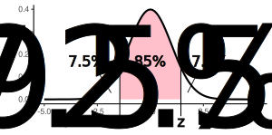
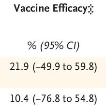

```{r message=FALSE}

library(tidyverse)
library(ggplot2)
library(cowplot)
library(MASS)
library(fitdistrplus)

```

# Example

Read the file "COVID-19-vaccines.pdf" about the effectiveness of the
vaccines Pfizer BioNTech (BNT162b2) and CoronaVac. We are interested in
paragraph Findings. Which vaccine is better?

1.  primary Pfizer + booster Pfizer
2.  primary CoronaVac + booster CoronaVac
3.  primary CoronaVac + booster Pfizer

# Confidence interval

Confidence interval is a range in which the true value of a random
variable is expected with some probability called **confidence level**
(CI). The most often used CI are 90%, 95%, 99%. An inverse parameter,
**significance level**, is denoted with Greek letter α = 1 - CI.

For example:



-   85% --- confidence interval
-   15% (= 7.5% + 7.5%) --- significance level
-   7.5% --- critical regions
-   z --- critical value

This example was made on a plot of standard normal distribution, but we
will need to use different distributions in different situations.

Additional reading: [R Practices for Learning Statistics, ch.
9](https://bookdown.org/logan_kelly/r_practice/p09.html).

## Mean

Confidence Intervals for normal populations is calculated as:

$$
\left(
\bar{X} - z \cdot SE,
\bar{X} + z \cdot SE
\right]
$$

where z is the value of the t-distribution corresponding to the
probability $P(t > z) = \alpha/2$.

Student t-distribution is represented by 4 functions in R: `dt()`,
`pt()`, `qt()`, `rt()`. Which function you will use to find z?

T-distribution has one parameters `df` (degrees of freedom) and, in case
of sample statistics, is equal to the number of observation minus 1:
`n-1`.

Find the critical values for 95% CI and 10 observations.

```{r}

alpha <- 0.05  # 5%

qt(p=alpha/2, df=10-1)
qt(p=1-alpha/2, df=10-1)

```

Increasing number of degrees of freedom (number of observations), the
shape of the distribution becomes more normal, and the values of z
corresponding to α=5% moves left to 1.96.

$$
\lim_{df \to \infty} z = 1.96
$$

Calculate z for α=5% and degrees of freedom equal to 10, 100, and 1000:

```{r}

qt(p=0.05/2, df=10, lower.tail=FALSE)
qt(p=0.05/2, df=100, lower.tail=FALSE)
qt(p=0.05/2, df=1000, lower.tail=FALSE)

```

Often, Data Analytics professionals use z = 1.96 as a constant, but it
is true only for samples big enough (1000+), and smaller datasets should
use a calculated value.

## Task 1

Read the file "data/high-school.csv", take column "TV" and calculate the
95% confidence interval of mean.

```{r}
data <- read_csv("/Users/ozodbekadkhamov/DataspellProjects/sample-statistics/data/high-school.csv")

n <- nrow(data)
m <- mean(data$TV)
se <- sd(data$TV) / sqrt(n)

alpha <- 0.05
z <- qt(p=alpha/2, df=n-1, lower.tail=F)

m_lower <- m - z * se
m_upper <- m + z * se

cat(sprintf("mean: %.2f\n", m))
cat(sprintf("(%.2f, %.2f]", m_lower, m_upper))


```

## Student vs Normal

When the sample size is increasing, the quantile of the Student
t-distribution with n − 1 degrees of freedom converges to the quantile
of the standard normal distribution. The quantiles of the t-distribution
are already quite close to the same quantiles of the normal distribution
when sample sizes are **larger than one hundred**.

Find quantiles 2.5% and 97.5% of the standard normal distribution:

```{r}
alpha <- 0.05
qnorm(alpha/2)
qnorm(1 - alpha/2)


```

## Task 2

Load dataset "Motor Trend Car Road Tests" and calculate the mean value
and 95% confidence interval for parameter "mpg" (miles per gallon).

```{r}

data("mtcars")
hist(mtcars$mpg, breaks=10)

```

```{r}

# confidence interval
n <- nrow(mtcars)
m <- mean(mtcars$mpg)
se <- sd(mtcars$mpg) / sqrt(n)

alpha <- 0.05
z <- qt(p=alpha/2, df=n-1, lower.tail=F)

m_lower <- m - z * se
m_upper <- m + z * se

cat(sprintf("mean: %.2f\n", m))
cat(sprintf("(%.2f, %.2f]", m_lower, m_upper))


```

## Easy way

Solve task #2 using "easy" method.

```{r}
model <- lm(TV ~ 1, data)
confint(model, level=0.95)

model <- lm(mpg ~ 1, mtcars)
confint(model, level=0.95)


```

## Standard deviation

Chi-square distribution (χ^2^ distribution) is a positive distribution
with one parameter `df`:

```{r fig.height=2, fig.width=4}

cat(sprintf("(%.2f, %.2f]", var_lower, var_upper))

ggplot() + xlim(0, 40) +
  stat_function(fun=dchisq, args=list(df=2), aes(color="df=2")) +
  stat_function(fun=dchisq, args=list(df=10), aes(color="df=10")) +
  stat_function(fun=dchisq, args=list(df=20), aes(color="df=20")) +
  scale_color_manual(
    breaks = c("df=2", "df=10", "df=20"),
    values = c("#f8766d", "#53b400", "#619cff"),
    name = "degree of freedom:"
  ) +
  theme_classic() +
  theme(legend.position = c(0.7, 0.7))

```

R provides a group of corresponding functions: `dchisq`, `pchisq`,
`qchisq`, `rchisq`.

Confidence interval of variance can be estimated from the following
equation:

$$
\left(
{(n-1) \cdot s^2 \over z_{1-p}}; 
{(n-1) \cdot s^2 \over z_{p}}
\right]
$$

Calculate z values defining the left and the right tails of the 95% CI
of chi-square distribution (n=20).

```{r}

alpha <- 0.05
n <- 20

# variant 1
qchisq(p=alpha/2, df=n-1)
qchisq(p=1-alpha/2, df=n-1)

```

Using the dataset from Exercise #1 (variable "TV"), find the confidence
interval of standard deviation:

```{r}
data <- read_csv("/Users/ozodbekadkhamov/DataspellProjects/sample-statistics/data/high-school.csv")

n <- nrow(data)
s <- sd(data$TV)

alpha <- 0.05
z_1 <- qchisq(p=alpha/2, df=n-1, lower.tail=FALSE)
z_2 <- qchisq(p=alpha/2, df=n-1, lower.tail=TRUE)

var_lower <- (n-1) * s^2 / z_1
var_upper <- (n-1) * s^2 / z_2

cat(sprintf("(%.2f, %.2f]", var_lower, var_upper))


```

## Normality

Usually, we calculate the interval according to 95% of confidence,
meaning that that in rare cases (5%) the true mean can drop out of the
interval.


Confidence interval derived from the central limit theorem depends on
the shape of the distribution. If it deviates significantly from the
Normal distribution, then the interval may be not fully correct.

For example, variable "TV" is skewed to the right. Taking samples by 40,
the global mean will be out of the confidence interval 60 times of 1000.

# Population proportion

A **population proportion** is a fraction of the population that has a
certain characteristic. For example, let's say you had 1,000 people in
the population and 237 of those people have blue eyes. The fraction of
people who have blue eyes is 237 out of 1,000, or 237/1000. The letter p
is used for the population proportion, so you would write this fact like
this:

$$
p = 237 / 1000
$$

## Example

A veterinary clinic reports that out of 3,412 animals registered at the
clinic, 1,712 are dogs, 1,012 are cats and the rest are rodents or
birds. What is the population proportion for dogs at the clinic?

```{r}
p <- 1712 / 3412
sprintf("%.1f%%", p * 100)


```

## Confidence Interval

Confidence interval (CI) for a proportion is calculated with the next
equation:

$$
\hat{p} \pm z \sqrt{
{\hat{p} (1 - \hat{p})}
\over
{n}
}
$$

where $\hat{p}$ is the proportion, z it the critical value of standard
normal distribution, and n is the total number of observations.

**Q1:** How the margin of error depends on the number of observations?

**Q2:** How it depends on the confidence interval?

This equation is valid when n is big enough. In practice, you can use
the next test:

$$
n \cdot \hat{p} \geq 5
\qquad
n \cdot (1 - \hat{p}) \geq 5
$$

## Task 3

You do a series of 50 experiments with 40 successes. Can you use the CI
equation in this case?

```{r}
p <- 40/50
50 * p
50 * (1-p)


```

Find the 99% CI for this series.

```{r}
alpha <- 1-0.99
n <- 50
p <- 40/n
z <- qnorm(1 - alpha/2)
SE <- sqrt(p*(1-p)/n)

sprintf("(%.2f, %.2f]", p-z*SE, p+z*SE)
sprintf("%.2f ± %.2f", p, z*SE)


```

Now find the CI for the portion of fails in the experiment.

```{r}
p <- 1 - 40/n
SE <- sqrt(p*(1-p)/n)

sprintf("(%.2f, %.2f]", p-z*SE, p+z*SE)
sprintf("%.2f ± %.2f", p, z*SE)


```

## Example

Returning to our example with COVID-19 vaccines, their efficacy can be
even negative, especially if they are tested on a new variant of the
virus [1]:

{width="147"}

In this case, the lower boundary of the confidence interval is negative
only technically, and should be treated as zero.

*[1] Madhi, Shabir A. et al. (2021) Efficacy of the ChAdOx1 nCoV-19
Covid-19 Vaccine against the B.1.351 Variant. New England Journal of
Medicine, 384:1885-1898. DOI:
[10.1056/NEJMoa2102214](http://dx.doi.org/10.1056/NEJMoa2102214).*

## Task 4

In total, 510 people applied to the Bachelor's in Elementary Education
program at Florida State College. Of those applicants, 57 were men. Find
the 90% CI of the true proportion of men who applied to the program.

```{r}

alpha <- 1-0.90
n <- 510
p <- 57/n
z <- qnorm(1 - alpha/2)
SE <- sqrt(p*(1-p)/n)

sprintf("(%.1f%%, %.1f%%]", (p-z*SE)*100, (p+z*SE)*100)
sprintf("%.1f%% ± %.1f%%", p*100, z*SE*100)

```

## Difference in proportions

Often researchers are interested in estimating the difference between
two population proportions. Be careful, this difference is not a simple
subtraction of one limit from another, but is calculated from the
equation:

$$
(p_1 - p_2) \pm z \cdot \sqrt{
{p_1 (1 - p_1) \over n_1} +
{p_2 (1 - p_2) \over n_2}
}
$$

where p~1~, p~2~ are sample proportions; z is the critical value of the
corresponding CI; n~1~, n~2~ are sample sizes.

## Task 5

A study in USA revealed that 65% of men surveyed supported the war in
Afghanistan and 33% of women supported the war. If 100 men and 75 women
were surveyed, find the 90% confidence interval for the data's true
**difference in proportions**.

```{r}

alpha <- 1-0.90

n_1 <- 100
p_1 <- 0.65

n_2 <- 75
p_2 <- 0.33

z <- qnorm(1 - alpha/2)
SE <- sqrt(p_1*(1-p_1)/n_1 + p_2*(1-p_2)/n_2)

sprintf("(%.1f%%, %.1f%%]", (p_1-p_2-z*SE)*100, (p_1-p_2+z*SE)*100)
sprintf("%.1f ± %.1f%%", (p_1-p_2)*100, z*SE*100)


```

## Task 6

We want to estimate the difference in the proportion of residents who
support a certain law in city A compared to the proportion who support
the law in city B. A survey shows that 62 out of 100 residents of city A
support the law, while only 46 out of 100 support it in city B. Find the
95% and 99% confidence intervals for the difference in proportions.

```{r}
alpha <- 1-0.95

n_1 <- 100
p_1 <- 0.62

n_2 <- 100
p_2 <- 0.46

z <- qnorm(1 - alpha/2)
SE <- sqrt(p_1*(1-p_1)/n_1 + p_2*(1-p_2)/n_2)

sprintf("(%.1f%%, %.1f%%]", (p_1-p_2-z*SE)*100, (p_1-p_2+z*SE)*100)
sprintf("%.1f ± %.1f%%", (p_1-p_2)*100, z*SE*100)


```

```{r}
alpha <- 1-0.99

z <- qnorm(1 - alpha/2)
SE <- sqrt(p_1*(1-p_1)/n_1 + p_2*(1-p_2)/n_2)

sprintf("(%.1f%%, %.1f%%]", (p_1-p_2-z*SE)*100, (p_1-p_2+z*SE)*100)
sprintf("%.1f ± %.1f%%", (p_1-p_2)*100, z*SE*100)


```

## Chi-squared test

**Pearson's chi-squared test** (χ^2^) is a statistical test to evaluate
how likely it is that any observed difference between the sets arose by
chance, or whether an **observed frequency** distribution differs from a
**theoretical distribution**.

Hypotheses

-   **H~0~**: there is **no significant difference** between the
    observed and the expected value.
-   **H~a~**: there is **a significant difference** between the observed
    and the expected value.

In this test we will use χ^2^ distribution and check its right tail. If
the value calculated from χ^2^ test lies to the right of critical value,
then H~0~ should be rejected. Otherwise, we cannot it reject and should
conclude the difference is not significant.

## Task 7

According to previous researches, the ration of red, yellow and white
tulip in our region is 3:2:1. We go to the field, and collect random
tulips, so our sample consists of 81 red, 50 yellow, and 27 white
flowers. We want to know, is there any significant difference between
the observed proportions and the expected proportions?

```{r}
expected <- c(3/6, 2/6, 1/6)
collected <- c(81, 50, 27)
res <- chisq.test(collected, p=expected)
res


```

You can use absolute frequencies instead of expected probabilities, but
in this case apply parameter `rescale.p=TRUE`.

```{r}

chisq.test(c(81, 50, 27), p=c(3, 2, 1), rescale.p=TRUE)

```

The result `chisq.test` contains some useful information:

```{r}

res$expected
res$observed

```

**N.B.** The chi-square test should be used only when all calculated
expected values are greater than 5.

Find the critical value of χ2 distribution corresponding to 95% CI.

```{r}
qchisq(0.95, 2)


```

The observed χ^2^ value is not in the forbidden region (5.99, +∞), so
the null hypothesis cannot be rejected. There is no significant
difference between the expected and observed frequencies.

In practice, we use p-value. If it is greater than the chosen
significance level (α), then H~0~ cannot be rejected.

## Task 8

{width="262"}

You and a friend are munching on a bag of M&M's, when your friend says,
"There seems to be more yellow and brown candies than red and maroon
candies. In fact, I claim there are 30% yellow, 30% brown, and only 20%
red and 20% maroon." Together you count the remaining M&M's in the bag
with the results below. Use the critical value method with significance
level 0.05 to test your friend's claim.

| color      | yellow | brown | red | maroon | total |
|------------|:------:|:-----:|:---:|:------:|:-----:|
| **number** |   58   |  61   | 55  |   46   |  220  |

H0: p~Y~ = p~B~ = 0.3, p~R~ = p~M~ = 0.2

```{r}
expected <- c(0.3, 0.3, 0.2, 0.2)
collected <- c(58, 61, 55, 46)
chisq.test(collected, p=expected)

qchisq(0.95, 3)


```

# Maximum Likelihood Estimation

Lets estimate the time spent in front of the television in the dataset
"high-school.csv". The PDF plot of the variable TV is similar to
Log-Normal, however this distribution cannot produce zeros.

We need to remove zeros from the dataset, so left only those children
that do watch television.

```{r}
data_positive <- filter(data, TV > 0)


```

Now use function `fitdistr` to find the best fitting parameters of a
Log-Normal distribution:

```{r}

fit.lnorm <- fitdistr(data_positive$TV, densfun="lognormal")
fit.lnorm

```

Try to approximate the "TV" data with a gamma distribution.

```{r}
fit.gamma <- fitdistr(data_positive$TV, densfun="gamma")
fit.gamma


```

In order to compare which distribution, Log Normal or Gamma, fits better
to the data, we can use χ^2^ test, but it is applicable only to discrete
distributions. So, first we use `hist` function to convert our data into
bins and calculate their frequencies. Then, we apply a density function
to find predicted proportions.

```{r warning=FALSE}
data_hist <- hist(data_positive$TV, breaks=30, plot=F)
expected <- data_hist$counts

observed <- dlnorm(
  data_hist$mids,
  meanlog = fit.lnorm$estimate[1],
  sdlog = fit.lnorm$estimate[2]
)

chisq.test(observed, p=expected, rescale.p=T)


```

Apply χ^2^ test to Gamma distribution.

```{r warning=FALSE}
observed <- dgamma(
  data_hist$mids,
  shape = fit.gamma$estimate[1],
  rate = fit.gamma$estimate[2]
)

chisq.test(observed, p=expected, rescale.p=T)


```

A lower value of χ^2^ test means there is a higher correlation between
the original and fitted data (good). If they are equal, then χ^2^ = 0.

## fitdistrplus

Library `fitdistrplus` provides convenient functions for fitting, and
several tests for goodness of fitting.

```{r}

library(fitdistrplus)

```

Fitting of Log Normal parameters and test can be made with few lines of
code.

```{r warning=FALSE}
fit.lnorm <- fitdist(data_positive$TV, "lnorm")
gofstat(fit.lnorm)


```

**N.B.** Functions `fitdistr` and `fitdist` do similar job but are not
interchangeable. Testing with `gofstat` accepts only `fitdist`.

Fit the "TV" data with Gamma distribution, and calculate goodness of fit
statistics.

```{r warning=FALSE}

fit.gamma <- fitdist(data_positive$TV, "gamma")
gofstat(list(fit.lnorm, fit.gamma))

```

We know, that our models do not fit the data exactly, so absolute values
of each test are not important. However, we can compare two models, so
lower values are better. Akaike's Information Criterion (AIC) is one of
the most popular test.

Skewness-kurtosis plot can be a guide in choosing candidate
distributions for fitting.

```{r}

descdist(data_positive$TV, discrete=FALSE)

```


